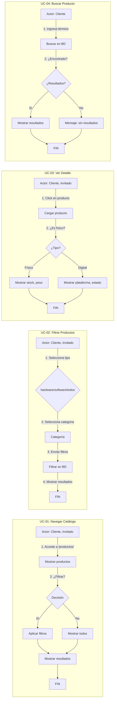

# Diagrama de Casos de Uso
## OmniTech ERP & E-Commerce

---

## Diagrama Principal de Casos de Uso

```mermaid
graph LR
    subgraph "ACTORES"
        CLIENT["👤 Cliente"]
        GUEST["👤 Invitado / Guest"]
        ADMIN["👨‍💼 Administrador"]
        STRIPE_SYS["💳 Sistema de Pagos\n(Stripe)"]
        EMAIL_SYS["📧 Sistema de Email\n(Nodemailer)"]
        WEBPAY["🏦 Webpay\n(Chile)"]
    end

    subgraph "PAQUETE: Catálogo"
        UC1["UC-01: Navegar Catálogo"]
        UC2["UC-02: Filtrar Productos"]
        UC3["UC-03: Ver Detalle de Producto"]
        UC4["UC-04: Buscar Producto"]
    end

    subgraph "PAQUETE: Carrito"
        UC5["UC-05: Agregar al Carrito"]
        UC6["UC-06: Modificar Cantidad"]
        UC7["UC-07: Eliminar del Carrito"]
        UC8["UC-08: Vaciar Carrito"]
        UC9["UC-09: Ver Carrito"]
    end

    subgraph "PAQUETE: Checkout"
        UC10["UC-10: Completar Checkout"]
        UC11["UC-11: Ingresar Datos de Envío"]
        UC12["UC-12: Seleccionar Ciudad"]
        UC13["UC-13: Revisar Resumen"]
        UC14["UC-14: Proceder al Pago"]
    end

    subgraph "PAQUETE: Pagos"
        UC15["UC-15: Procesar Pago"]
        UC16["UC-16: Cancelar Pago"]
        UC17["UC-17: Recibir Notificación Pago"]
    end

    subgraph "PAQUETE: Pedidos"
        UC18["UC-18: Ver Pedidos"]
        UC19["UC-19: Ver Detalle de Pedido"]
        UC20["UC-20: Ver Estado de Pedido"]
        UC21["UC-21: Cancelar Pedido"]
    end

    subgraph "PAQUETE: Licencias"
        UC22["UC-22: Ver Mis Licencias"]
        UC23["UC-23: Ver Clave de Licencia"]
    end

    subgraph "PAQUETE: Usuario"
        UC24["UC-24: Registrarse"]
        UC25["UC-25: Iniciar Sesión"]
        UC26["UC-26: Cerrar Sesión"]
        UC27["UC-27: Ver Perfil"]
        UC28["UC-28: Editar Perfil"]
        UC29["UC-29: Comprar como Invitado"]
        UC30["UC-30: Crear Cuenta Post-Compra"]
    end

    subgraph "PAQUETE: Administrador"
        UC31["UC-31: Gestionar Productos"]
        UC32["UC-32: Gestionar Pedidos"]
        UC33["UC-33: Gestionar Licencias"]
        UC34["UC-34: Ver Reportes"]
        UC35["UC-35: Gestionar Stock"]
    end

    subgraph "PAQUETE: Sistema"
        UC36["UC-36: Enviar Boleta por Email"]
        UC37["UC-37: Generar Boleta PDF"]
        UC38["UC-38: Reservar Stock"]
        UC39["UC-39: Confirmar Reserva"]
        UC40["UC-40: Liberar Reserva"]
        UC41["UC-41: Generar Orden de Reabastecimiento"]
        UC42["UC-42: Encriptar Clave de Licencia"]
        UC43["UC-43: Desencriptar Clave de Licencia"]
    end

    CLIENT --> UC1
    CLIENT --> UC2
    CLIENT --> UC3
    CLIENT --> UC4
    CLIENT --> UC5
    CLIENT --> UC6
    CLIENT --> UC7
    CLIENT --> UC8
    CLIENT --> UC9
    CLIENT --> UC10
    CLIENT --> UC11
    CLIENT --> UC12
    CLIENT --> UC13
    CLIENT --> UC14
    CLIENT --> UC15
    CLIENT --> UC18
    CLIENT --> UC19
    CLIENT --> UC20
    CLIENT --> UC21
    CLIENT --> UC22
    CLIENT --> UC23
    CLIENT --> UC25
    CLIENT --> UC26
    CLIENT --> UC27
    CLIENT --> UC28

    GUEST --> UC1
    GUEST --> UC2
    GUEST --> UC3
    GUEST --> UC5
    GUEST --> UC9
    GUEST --> UC10
    GUEST --> UC11
    GUEST --> UC12
    GUEST --> UC14
    GUEST --> UC15
    GUEST --> UC29
    GUEST --> UC30

    ADMIN --> UC1
    ADMIN --> UC2
    ADMIN --> UC3
    ADMIN --> UC31
    ADMIN --> UC32
    ADMIN --> UC33
    ADMIN --> UC34
    ADMIN --> UC35

    UC5 --> UC38
    UC14 --> UC38
    UC15 --> UC39
    UC15 --> UC36
    UC15 --> UC40
    UC36 --> UC37
    UC15 --> UC17
    UC17 --> UC21

    STRIPE_SYS --> UC15
    STRIPE_SYS --> UC17
    UC15 --> STRIPE_SYS
    UC15 --> WEBPAY

    UC36 --> EMAIL_SYS
    EMAIL_SYS --> UC36

    UC31 --> UC42
    UC23 --> UC43
```

---

## Especificación Detallada de Casos de Uso

### PAQUETE: Catálogo

---

### PAQUETE: Carrito

```mermaid
flowchart TD
    subgraph "UC-05: Agregar al Carrito"
        A5["Actor: Cliente, Invitado"] --> D5{Validar}
        D5 -->|"Stock disponible"| R5["Agregar a sesión"]
        D5 -->|"Sin stock"| E5["Error"]
        R5 --> S5["Confirmar"]
        S5 --> END5[FIN]
        E5 --> END5
    end

    subgraph "UC-06: Modificar Cantidad"
        A6["Actor: Cliente"] --> S6["Ingresar cantidad"]
        S6 --> V6{¿Válida?}
        V6 -->|"Sí"| U6["Actualizar sesión"]
        V6 -->|"No"| E6["Error"]
        U6 --> REC6["Recalcular totales"]
        E6 --> END6[FIN]
        REC6 --> END6
    end

    subgraph "UC-07: Eliminar del Carrito"
        A7["Actor: Cliente"] --> S7["Click eliminar"]
        S7 --> F7["Filtrar item"]
        F7 --> U7["Actualizar sesión"]
        U7 --> REC7["Recalcular"]
        REC7 --> END7[FIN]
    end

    subgraph "UC-08: Vaciar Carrito"
        A8["Actor: Cliente"] --> S8["Click vaciar"]
        S8 --> C8["carrito = []"]
        C8 --> S8A["Guardar sesión"]
        S8A --> END8[FIN]
    end

    subgraph "UC-09: Ver Carrito"
        A9["Actor: Cliente, Invitado"] --> G9["Obtener carrito sesión"]
        G9 --> L9["Para cada item"]
        L9 --> GET9["Obtener producto DB"]
        GET9 --> CALC9["Calcular subtotal"]
        CALC9 --> DISP9["Mostrar lista"]
        L9 -.->|"Fin"| TOT9["Calcular totales"]
        DISP9 --> TOT9
        TOT9 --> END9[FIN]
    end
```

---

### PAQUETE: Checkout

```mermaid
flowchart TD
    subgraph "UC-10: Completar Checkout"
        A10["Actor: Cliente, Invitado"] --> C10["Verificar carrito"]
        C10 -->|"¿Items?"| I10{¿Items?}
        I10 -->|"No"| E10["Redirigir a productos"]
        I10 -->|"Sí"| F10["Mostrar formulario"]
        F10 --> D10["Ingresar datos"]
        D10 --> V10{¿Válido?}
        V10 -->|"No"| ER10["Mostrar errores"]
        ER10 --> D10
        V10 -->|"Sí"| S10["Crear Order"]
        S10 --> END10[FIN]
        E10 --> END10
    end

    subgraph "UC-11: Ingresar Datos de Envío"
        A11["Actor: Cliente, Invitado"] --> F11["Formulario envío"]
        F11 --> FI11["Email"]
        FI11 --> RE11["Región"]
        RE11 --> CI11["Ciudad"]
        CI11 --> OB11["Observaciones"]
        OB11 --> V11["Validar"]
        V11 -->|"OK"| S11["Guardar datos"]
        V11 -->|"Error"| ER11["Corregir"]
        ER11 --> F11
        S11 --> END11[FIN]
    end

    subgraph "UC-12: Seleccionar Ciudad"
        A12["Actor: Cliente, Invitado"] --> RE12["Seleccionar región"]
        RE12 --> C12["Cargar ciudades"]
        C12 --> L12["Lista ciudades"]
        L12 --> S12["Seleccionar ciudad"]
        S12 --> END12[FIN]
    end

    subgraph "UC-13: Revisar Resumen"
        A13["Actor: Cliente, Invitado"] --> IT13["Lista items"]
        IT13 --> SUB13["Subtotal"]
        SUB13 --> ENV13["Costo envío"]
        ENV13 --> TOT13["Total"]
        TOT13 --> R13["¿Región Araucanía?"]
        R13 -->|"Sí > 100K"| SUB13A["Envío gratis"]
        R13 -->|"No"| SUB13N["Envío normal"]
        SUB13A --> END13[FIN]
        SUB13N --> END13
    end

    subgraph "UC-14: Proceder al Pago"
        A14["Actor: Cliente, Invitado"] --> B14["Revisar resumen"]
        B14 --> S14["Click 'Pagar'"]
        S14 --> C14["Crear Order PENDIENTE"]
        C14 --> SS14["Crear Stripe Session"]
        SS14 --> R14["Redirect a Stripe"]
        R14 --> END14[FIN]
    end
```

---

### PAQUETE: Pagos

```mermaid
flowchart TD
    subgraph "UC-15: Procesar Pago"
        A15["Actor: Cliente, Invitado"] --> S15["Selecciona método"]
        S15 --> T15{¿Tarjeta/Webpay?}
        T15 -->|"Tarjeta"| STR15["Stripe Checkout"]
        T15 -->|"Webpay"| WP15["Webpay Chile"]
        STR15 --> P15["Ingresa datos"]
        WP15 --> P15
        P15 --> AUT15{¿Autenticado?}
        AUT15 -->|"3D Secure"| V15["Validar"]
        AUT15 -->|"No"| V15
        V15 -->|"OK"| CH15["Cargo exitoso"]
        V15 -->|"Fallido"| F15["Error pago"]
        CH15 --> END15[FIN Éxito]
        F15 --> END15F[FIN Fallido]
    end

    subgraph "UC-16: Cancelar Pago"
        A16["Actor: Cliente"] --> C16["Click cancelar"]
        C16 --> R16["Redirect cancel_url"]
        R16 --> U16["¿Order creada?"]
        U16 -->|"Sí"| D16["Eliminar Order"]
        U16 -->|"No"| M16["Solo redirigir"]
        D16 --> L16["Liberar reservas"]
        L16 --> M16
        M16 --> END16[FIN]
    end

    subgraph "UC-17: Recibir Notificación"
        A17["Actor: Sistema (Stripe)"] --> WH17["Webhook recibido"]
        WH17 --> V17["Verificar firma"]
        V17 --> E17{¿Válida?}
        E17 -->|"Sí"| P17["Procesar evento"]
        E17 -->|"No"| RE17["Rechazar"]
        P17 -->|"payment_intent.succeeded"| UP17["Actualizar Order"]
        P17 -->|"payment_intent.failed"| ER17["Marcar error"]
        UP17 --> S17["Enviar boleta"]
        ER17 --> END17E[FIN Error]
        RE17 --> END17R[FIN Rechazado]
        S17 --> END17S[FIN OK]
    end
```

---

### PAQUETE: Pedidos

```mermaid
flowchart TD
    subgraph "UC-18: Ver Pedidos"
        A18["Actor: Cliente"] --> L18["Listar pedidos"]
        L18 --> Q18["Query: usuario actual"]
        Q18 --> O18["Filtrar por estado"]
        O18 --> S18["Mostrar lista"]
        S18 --> P18["Paginación"]
        P18 --> END18[FIN]
    end

    subgraph "UC-19: Ver Detalle de Pedido"
        A19["Actor: Cliente"] --> S19["Seleccionar pedido"]
        S19 --> D19["Cargar Order"]
        D19 --> I19["Cargar OrderItems"]
        I19 --> DIS19["Mostrar detalle"]
        DIS19 --> IT19{¿Items?}
        IT19 -->|"Físicos"| HW19["Mostrar datos HW"]
        IT19 -->|"Digitales"| SW19["Mostrar licencias"]
        HW19 --> END19[FIN]
        SW19 --> END19
    end

    subgraph "UC-20: Ver Estado de Pedido"
        A20["Actor: Cliente"] --> S20["Seleccionar pedido"]
        S20 --> E20["Obtener estado"]
        E20 --> D20{¿Estado?}
        D20 -->|"PENDIENTE_PAGO"| ST20["Esperando pago"]
        D20 -->|"PAGADO_PROCESANDO"| SP20["Procesando"]
        D20 -->|"COMPLETADO"| SC20["Completado"]
        D20 -->|"CANCELADO"| SX20["Cancelado"]
        ST20 --> END20[FIN]
        SP20 --> END20
        SC20 --> END20
        SX20 --> END20
    end

    subgraph "UC-21: Cancelar Pedido"
        A21["Actor: Cliente"] --> S21["Seleccionar pedido"]
        S21 --> C21{¿Cancelable?}
        C21 -->|"PENDIENTE_PAGO"| CAN21["Cancelar Order"]
        C21 -->|"PAGADO"| REF21["Solicitar reembolso"]
        C21 -->|"COMPLETADO"| REJ21["No cancelable"]
        CAN21 --> L21["Liberar stock"]
        L21 --> E21["Enviar notificación"]
        E21 --> END21C[FIN Cancelado]
        REF21 --> END21R[FIN Refund]
        REJ21 --> END21E[FIN Error]
    end
```

---

### PAQUETE: Licencias

```mermaid
flowchart TD
    subgraph "UC-22: Ver Mis Licencias"
        A22["Actor: Cliente"] --> Q22["Query licencias usuario"]
        Q22 --> F22["Filtrar: orden_compra.usuario"]
        F22 --> L22["Lista licencias"]
        L22 --> S22["Mostrar tabla"]
        S22 --> D22["¿Detalles?"]
        D22 -->|"Sí"| SH22["Mostrar clave"]
        D22 -->|"No"| END22[FIN]
        SH22 --> END22
    end

    subgraph "UC-23: Ver Clave de Licencia"
        A23["Actor: Cliente"] --> S23["Seleccionar licencia"]
        S23 --> ST23{¿Consumida?}
        ST23 -->|"Sí"| CK23["Verificar propiedad"]
        ST23 -->|"No"| REJ23["Acceso denegado"]
        CK23 --> V23{¿Propio?}
        V23 -->|"Sí"| DC23["desencriptar_clave()"]
        V23 -->|"No"| REJ23
        DC23 --> SH23["Mostrar clave"]
        SH23 --> END23[FIN]
        REJ23 --> END23E[FIN Denegado]
    end
```

---

### PAQUETE: Usuario

```mermaid
flowchart TD
    subgraph "UC-24: Registrarse"
        A24["Actor: Cliente"] --> F24["Formulario registro"]
        F24 --> D24["Ingresar datos"]
        D24 --> V24{¿Válido?}
        V24 -->|"No"| E24["Mostrar errores"]
        E24 --> F24
        V24 -->|"Sí"| C24["create_user()"]
        C24 --> P24["create Perfil()"]
        P24 --> L24["Autologin"]
        L24 --> END24[FIN]
    end

    subgraph "UC-25: Iniciar Sesión"
        A25["Actor: Cliente"] --> F25["Formulario login"]
        F25 --> C25["Ingresar credenciales"]
        C25 --> A25["authenticate()"]
        A25 --> R25{¿Válido?}
        R25 -->|"Sí"| L25["login()"]
        R25 -->|"No"| E25["Error"]
        L25 --> END25L[FIN Logueado]
        E25 --> END25E[FIN Error]
    end

    subgraph "UC-26: Cerrar Sesión"
        A26["Actor: Cliente"] --> C26["Click logout"]
        C26 --> L26["logout()"]
        L26 --> S26["Limpiar sesión"]
        S26 --> R26["Redirect home"]
        R26 --> END26[FIN]
    end

    subgraph "UC-27: Ver Perfil"
        A27["Actor: Cliente"] --> G27["Obtener usuario"]
        G27 --> P27["Obtener Perfil"]
        P27 --> D27["Calcular estadísticas"]
        D27 --> SH27["Mostrar perfil"]
        SH27 --> END27[FIN]
    end

    subgraph "UC-28: Editar Perfil"
        A28["Actor: Cliente"] --> F28["Formulario editar"]
        F28 --> D28["Modificar datos"]
        D28 --> V28{¿Válido?}
        V28 -->|"Sí"| S28["Guardar"]
        V28 -->|"No"| E28["Errores"]
        E28 --> F28
        S28 --> END28[FIN]
    end

    subgraph "UC-29: Comprar como Invitado"
        A29["Actor: Invitado"] --> F29["Checkout guest"]
        F29 --> E29["Solo email obligatorio"]
        E29 --> P29["Procesar pago"]
        P29 -->|"OK"| C29["Crear Order guest"]
        C29 --> M29["Enviar boleta"]
        M29 --> SH29["Mostrar éxito"]
        SH29 --> OF29["Ofrecer registro"]
        OF29 --> END29[FIN]
    end

    subgraph "UC-30: Crear Cuenta Post-Compra"
        A30["Actor: Invitado"] --> A30["Acepta oferta"]
        A30 --> F30["Formulario contraseña"]
        F30 --> C30["create_user()"]
        C30 --> V30["Vincular pedido"]
        V30 --> E30["Enviar credenciales"]
        E30 --> END30[FIN]
    end
```

---

### PAQUETE: Administrador

```mermaid
flowchart TD
    subgraph "UC-31: Gestionar Productos"
        A31["Actor: Admin"] --> L31["Listar productos"]
        L31 --> C31{¿Acción?}
        C31 -->|"Crear"| F31["Formulario nuevo"]
        C31 -->|"Editar"| FE31["Formulario editar"]
        C31 -->|"Eliminar"| DE31["Confirmar eliminar"]
        F31 --> S31["Guardar"]
        FE31 --> S31
        S31 --> V31["Validar"]
        V31 -->|"OK"| END31[FIN]
        V31 -->|"Error"| F31
        DE31 --> END31
    end

    subgraph "UC-32: Gestionar Pedidos"
        A32["Actor: Admin"] --> L32["Listar pedidos"]
        L32 --> F32["Filtrar por estado"]
        F32 --> S32["Seleccionar pedido"]
        S32 --> A32{¿Acción?}
        A32 -->|"Ver"| V32["Ver detalle"]
        A32 -->|"Actualizar"| UP32["Cambiar estado"]
        A32 -->|"Cancelar"| CA32["Cancelar"]
        V32 --> END32[FIN]
        UP32 --> END32
        CA32 --> END32
    end

    subgraph "UC-33: Gestionar Licencias"
        A33["Actor: Admin"] --> L33["Listar licencias"]
        L33 --> F33["Filtrar por estado"]
        F33 --> S33["Seleccionar"]
        S33 --> A33{¿Acción?}
        A33 -->|"Crear"| CR33["Crear licencia"]
        A33 -->|"Ver claves"| VK33["Ver clave encriptada"]
        CR33 --> END33[FIN]
        VK33 --> END33
    end

    subgraph "UC-34: Ver Reportes"
        A34["Actor: Admin"] --> S34["Seleccionar reporte"]
        S34 --> T34{¿Tipo?}
        T34 -->|"Ventas"| R34["Reporte ventas"]
        T34 -->|"Stock"| R35["Reporte stock bajo"]
        T34 -->|"Licencias"| R36["Reporte licencias"]
        R34 --> D34["Generar datos"]
        R35 --> D34
        R36 --> D34
        D34 --> E34["Exportar/PDF"]
        E34 --> END34[FIN]
    end

    subgraph "UC-35: Gestionar Stock"
        A35["Actor: Admin"] --> L35["Listar productos HW"]
        L35 --> S35["Seleccionar producto"]
        S35 --> V35["Ver stock actual"]
        V35 --> A35{¿Acción?}
        A35 -->|"Agregar"| AG35["Agregar stock"]
        A35 -->|"Ajustar"| AJ35["Ajuste manual"]
        AG35 --> END35[FIN]
        AJ35 --> END35
    end
```

---

### PAQUETE: Sistema (Automáticos)

```mermaid
flowchart TD
    subgraph "UC-36: Enviar Boleta por Email"
        S36["Sistema"] --> G36["Generar HTML"]
        G36 --> E36["Preparar email"]
        E36 --> S36A["Enviar Nodemailer"]
        S36A --> R36{¿Éxito?}
        R36 -->|"Sí"| L36["Log éxito"]
        R36 -->|"No"| L36E["Log error"]
        L36 --> END36[FIN]
        L36E --> END36E[FIN Error]
    end

    subgraph "UC-37: Generar Boleta PDF"
        S37["Sistema"] --> H37["Generar HTML"]
        H37 --> P37["Convertir a PDF"]
        P37 --> A37["Adjuntar a email"]
        A37 --> END37[FIN]
    end

    subgraph "UC-38: Reservar Stock"
        S38["Sistema"] --> C38["Verificar disponible"]
        C38 --> SUF38{¿Suficiente?}
        SUF38 -->|"Sí"| R38["stock_reservado += cant"]
        SUF38 -->|"No"| E38["Error"]
        R38 --> T38["Guardar BD"]
        T38 --> END38R[FIN Reservado]
        E38 --> END38E[FIN Error]
    end

    subgraph "UC-39: Confirmar Reserva"
        S39["Sistema"] --> P39["Pago exitoso"]
        P39 --> CF39["stock_fisico -= cant"]
        CF39 --> SR39["stock_reservado -= cant"]
        SR39 --> G39["Guardar BD"]
        G39 --> END39[FIN]
    end

    subgraph "UC-40: Liberar Reserva"
        S40["Sistema"] --> C40["Checkout cancelado"]
        C40 --> L40["stock_reservado -= cant"]
        L40 --> G40["Guardar BD"]
        G40 --> END40[FIN]
    end

    subgraph "UC-41: Generar Orden Reabastecimiento"
        S41["Sistema"] --> C41["stock_disponible bajo"]
        C41 --> T41{¿Umbral?}
        T41 -->|"Sí"| O41["Crear Purchase Order"]
        T41 -->|"No"| END41E[FIN]
        O41 --> N41["Notificar proveedor"]
        N41 --> END41[FIN]
    end

    subgraph "UC-42: Encriptar Clave"
        S42["Sistema"] --> E42["encriptar_clave()"]
        E42 --> F42["Fernet con SECRET_KEY"]
        F42 --> G42["Guardar clave"]
        G42 --> END42[FIN]
    end

    subgraph "UC-43: Desencriptar Clave"
        S43["Sistema"] --> L43["Licencia consumida"]
        L43 --> D43["desencriptar_clave()"]
        D43 --> F43["Fernet decrypt"]
        F43 --> R43["Retornar clave"]
        R43 --> END43[FIN]
    end
```

---

## Tabla Resumen de Casos de Uso

| ID | Caso de Uso | Actor Principal | Actor Secundario |
|----|-------------|----------------|------------------|
| UC-01 | Navegar Catálogo | Cliente, Invitado | - |
| UC-02 | Filtrar Productos | Cliente, Invitado | - |
| UC-03 | Ver Detalle de Producto | Cliente, Invitado | - |
| UC-04 | Buscar Producto | Cliente | - |
| UC-05 | Agregar al Carrito | Cliente, Invitado | Sistema |
| UC-06 | Modificar Cantidad | Cliente | - |
| UC-07 | Eliminar del Carrito | Cliente | - |
| UC-08 | Vaciar Carrito | Cliente | - |
| UC-09 | Ver Carrito | Cliente, Invitado | - |
| UC-10 | Completar Checkout | Cliente, Invitado | Sistema |
| UC-11 | Ingresar Datos de Envío | Cliente, Invitado | - |
| UC-12 | Seleccionar Ciudad | Cliente, Invitado | - |
| UC-13 | Revisar Resumen | Cliente, Invitado | - |
| UC-14 | Proceder al Pago | Cliente, Invitado | Stripe |
| UC-15 | Procesar Pago | Cliente, Invitado | Stripe, Webpay |
| UC-16 | Cancelar Pago | Cliente | Sistema |
| UC-17 | Recibir Notificación Pago | Sistema (Stripe) | - |
| UC-18 | Ver Pedidos | Cliente | - |
| UC-19 | Ver Detalle de Pedido | Cliente | - |
| UC-20 | Ver Estado de Pedido | Cliente | - |
| UC-21 | Cancelar Pedido | Cliente | Sistema |
| UC-22 | Ver Mis Licencias | Cliente | - |
| UC-23 | Ver Clave de Licencia | Cliente | Sistema |
| UC-24 | Registrarse | Cliente | - |
| UC-25 | Iniciar Sesión | Cliente | - |
| UC-26 | Cerrar Sesión | Cliente | - |
| UC-27 | Ver Perfil | Cliente | - |
| UC-28 | Editar Perfil | Cliente | - |
| UC-29 | Comprar como Invitado | Invitado | Sistema |
| UC-30 | Crear Cuenta Post-Compra | Invitado | Sistema |
| UC-31 | Gestionar Productos | Administrador | - |
| UC-32 | Gestionar Pedidos | Administrador | Sistema |
| UC-33 | Gestionar Licencias | Administrador | - |
| UC-34 | Ver Reportes | Administrador | - |
| UC-35 | Gestionar Stock | Administrador | - |
| UC-36 | Enviar Boleta por Email | Sistema | Email |
| UC-37 | Generar Boleta PDF | Sistema | - |
| UC-38 | Reservar Stock | Sistema | - |
| UC-39 | Confirmar Reserva | Sistema | - |
| UC-40 | Liberar Reserva | Sistema | - |
| UC-41 | Generar Orden Reabastecimiento | Sistema | - |
| UC-42 | Encriptar Clave | Sistema | - |
| UC-43 | Desencriptar Clave | Sistema | - |
