# DIAGRAMA DE CASOS DE USO - OmniTech ERP & E-Commerce
## Versión Compacta para Renderizar en Mermaid

---

## Vista General del Sistema

```mermaid
graph TB
    subgraph "OMNITECH E-COMMERCE"
        subgraph "👥 ACTORES"
            CLIENT["👤 Cliente Registrado"]
            GUEST["👤 Invitado (Guest)"]
            ADMIN["👨‍💼 Administrador"]
            STRIPE["💳 Stripe"]
            EMAIL["📧 Email Service"]
        end

        subgraph "📦 PAQUETE: Catálogo"
            UC01["UC-01: Navegar Catálogo"]
            UC02["UC-02: Filtrar Productos"]
            UC03["UC-03: Ver Detalle Producto"]
            UC04["UC-04: Buscar Producto"]
        end

        subgraph "🛒 PAQUETE: Carrito"
            UC05["UC-05: Agregar al Carrito"]
            UC06["UC-06: Modificar Cantidad"]
            UC07["UC-07: Eliminar Item"]
            UC08["UC-08: Vaciar Carrito"]
            UC09["UC-09: Ver Carrito"]
        end

        subgraph "💳 PAQUETE: Checkout & Pagos"
            UC10["UC-10: Checkout"]
            UC11["UC-11: Datos de Envío"]
            UC14["UC-14: Proceder al Pago"]
            UC15["UC-15: Procesar Pago"]
            UC16["UC-16: Cancelar Pago"]
        end

        subgraph "📋 PAQUETE: Pedidos"
            UC18["UC-18: Ver Mis Pedidos"]
            UC19["UC-19: Detalle Pedido"]
            UC20["UC-20: Estado Pedido"]
            UC21["UC-21: Cancelar Pedido"]
        end

        subgraph "🔑 PAQUETE: Licencias"
            UC22["UC-22: Ver Mis Licencias"]
            UC23["UC-23: Ver Clave"]
        end

        subgraph "👤 PAQUETE: Usuario"
            UC24["UC-24: Registrarse"]
            UC25["UC-25: Iniciar Sesión"]
            UC26["UC-26: Cerrar Sesión"]
            UC27["UC-27: Ver Perfil"]
            UC28["UC-28: Editar Perfil"]
            UC29["UC-29: Guest Checkout"]
            UC30["UC-30: Crear Cuenta Post-Compra"]
        end

        subgraph "⚙️ PAQUETE: Administración"
            UC31["UC-31: Gestionar Productos"]
            UC32["UC-32: Gestionar Pedidos"]
            UC33["UC-33: Gestionar Licencias"]
            UC34["UC-34: Ver Reportes"]
            UC35["UC-35: Gestionar Stock"]
        end

        subgraph "🔄 PAQUETE: Sistema (Background)"
            UC36["UC-36: Enviar Boleta"]
            UC37["UC-37: Generar PDF"]
            UC38["UC-38: Reservar Stock"]
            UC39["UC-39: Confirmar Reserva"]
            UC40["UC-40: Liberar Reserva"]
            UC41["UC-41: Reabastecimiento"]
            UC42["UC-42: Encriptar Clave"]
            UC43["UC-43: Desencriptar Clave"]
        end
    end

    CLIENT --> UC01
    CLIENT --> UC02
    CLIENT --> UC03
    CLIENT --> UC04
    CLIENT --> UC05
    CLIENT --> UC06
    CLIENT --> UC07
    CLIENT --> UC08
    CLIENT --> UC09
    CLIENT --> UC10
    CLIENT --> UC11
    CLIENT --> UC14
    CLIENT --> UC15
    CLIENT --> UC16
    CLIENT --> UC18
    CLIENT --> UC19
    CLIENT --> UC20
    CLIENT --> UC21
    CLIENT --> UC22
    CLIENT --> UC23
    CLIENT --> UC25
    CLIENT --> UC26
    CLIENT --> UC27
    CLIENT --> UC28

    GUEST --> UC01
    GUEST --> UC02
    GUEST --> UC03
    GUEST --> UC05
    GUEST --> UC09
    GUEST --> UC10
    GUEST --> UC11
    GUEST --> UC14
    GUEST --> UC29
    GUEST --> UC30

    ADMIN --> UC01
    ADMIN --> UC02
    ADMIN --> UC03
    ADMIN --> UC31
    ADMIN --> UC32
    ADMIN --> UC33
    ADMIN --> UC34
    ADMIN --> UC35

    UC05 --> UC38
    UC14 --> UC38
    UC15 --> UC39
    UC15 --> UC36
    UC15 --> UC40
    UC36 --> EMAIL
    UC36 --> UC37
    UC15 <--> STRIPE
    UC15 --> UC16
```

---

## Paquete: Catálogo (Detallado)

```mermaid
flowchart TB
    subgraph "UC-01: Navegar Catálogo"
        A1["Cliente/Invitado"] --> V1["Ver /productos/"]
        V1 --> F1{¿Filtros?}
        F1 -->|Sí| AP1["Aplicar filtros"]
        F1 -->|No| M1["Mostrar todos"]
        AP1 --> R1["Resultados"]
        M1 --> R1
        R1 --> C1["Click producto"]
        C1 --> F2["Ver detalle"]
        F2 --> FIN1
    end

    subgraph "UC-02: Filtrar Productos"
        A2["Cliente"] --> T2["Seleccionar tipo"]
        T2 --> C2["Seleccionar categoría"]
        C2 --> E2["Enviar filtros"]
        E2 --> B2["Buscar en BD"]
        B2 --> R2["Resultados"]
        R2 --> FIN2
    end

    subgraph "UC-03: Ver Detalle"
        A3["Cliente/Invitado"] --> P3["Seleccionar producto"]
        P3 --> T3{¿Tipo?}
        T3 -->|Físico| D3F["Mostrar: stock, peso, bodega"]
        T3 -->|Digital| D3D["Mostrar: plataforma, duración"]
        D3F --> FIN3
        D3D --> FIN3
    end

    subgraph "UC-04: Buscar"
        A4["Cliente"] --> B4["Ingresar término"]
        B4 --> Q4["Query LIKE"]
        Q4 --> R4{¿Resultados?}
        R4 -->|Sí| L4["Lista resultados"]
        R4 -->|No| M4["Sin resultados"]
        L4 --> FIN4
        M4 --> FIN4
    end
```

---

## Paquete: Carrito (Detallado)

```mermaid
flowchart TB
    subgraph "UC-05: Agregar al Carrito"
        A5["Cliente/Invitado"] --> P5["Seleccionar producto"]
        P5 --> C5["Ingresar cantidad"]
        C5 --> V5{¿Stock OK?}
        V5 -->|Sí| AG5["Agregar a sesión"]
        V5 -->|No| E5["Error stock"]
        AG5 --> FIN5
        E5 --> FIN5
    end

    subgraph "UC-06: Modificar Cantidad"
        A6["Cliente"] --> I6["Seleccionar item"]
        I6 --> N6["Nueva cantidad"]
        N6 --> V6{¿Stock OK?}
        V6 -->|Sí| AC6["Actualizar sesión"]
        V6 -->|No| E6["Error"]
        AC6 --> T6["Recalcular totales"]
        T6 --> FIN6
        E6 --> FIN6
    end

    subgraph "UC-07: Eliminar Item"
        A7["Cliente"] --> X7["Click eliminar"]
        X7 --> FI7["Filtrar item"]
        FI7 --> EL7["Eliminar"]
        EL7 --> GU7["Guardar sesión"]
        GU7 --> T7["Recalcular"]
        T7 --> FIN7
    end

    subgraph "UC-09: Ver Carrito"
        A9["Cliente/Invitado"] --> V9["Ir a /carrito/"]
        V9 --> C9["Cargar items sesión"]
        C9 --> L9["Para cada item"]
        L9 --> G9["Obtener producto DB"]
        G9 --> S9["Calcular subtotal"]
        S9 --> MOSTRAR["Mostrar lista"]
        L9 -.->|"Fin"| TOT9["Totales"]
        MOSTRAR --> TOT9
        TOT9 --> FIN9
    end
```

---

## Paquete: Checkout & Pagos (Detallado)

```mermaid
flowchart TB
    subgraph "UC-10: Checkout"
        A10["Cliente/Invitado"] --> V10["Ir a /checkout/"]
        V10 --> C10{¿Carrito vacío?}
        C10 -->|Sí| E10["Redirigir"]
        C10 -->|No| F10["Mostrar formulario"]
        F10 --> D10["Ingresar datos"]
        D10 --> VAL10{¿Válido?}
        VAL10 -->|No| ER10["Errores"]
        ER10 --> F10
        VAL10 -->|Sí| FIN10
    end

    subgraph "UC-14: Proceder al Pago"
        A14["Cliente/Invitado"] --> R14["Revisar resumen"]
        R14 --> C14["Click 'Pagar'"]
        C14 --> CR14["Crear Order PENDIENTE"]
        CR14 --> SS14["Crear Stripe Session"]
        SS14 --> RED14["Redirect Stripe"]
        RED14 --> FIN14
    end

    subgraph "UC-15: Procesar Pago"
        A15["Cliente"] --> P15["En Stripe"]
        P15 --> MET15{¿Método?}
        MET15 -->|Tarjeta| ST15["Stripe"]
        MET15 -->|Webpay| WP15["Webpay CL"]
        ST15 --> PA15["Procesar"]
        WP15 --> PA15
        PA15 --> R15{¿Resultado?}
        R15 -->|Éxito| OK15["Redirigir éxito"]
        R15 -->|Error| ER15["Mostrar error"]
        OK15 --> FIN15O
        ER15 --> FIN15E
    end

    subgraph "UC-16: Cancelar Pago"
        A16["Cliente"] --> CA16["Click cancelar"]
        CA16 --> RE16["Redirect cancel_url"]
        RE16 --> CAN16["¿Order existe?"]
        CAN16 -->|Sí| EL16["Eliminar Order"]
        CAN16 -->|No| S16["Fin"]
        EL16 --> LIB16["Liberar reservas"]
        LIB16 --> S16 --> FIN16
    end
```

---

## Paquete: Usuario (Detallado)

```mermaid
flowchart TB
    subgraph "UC-24: Registrarse"
        A24["Cliente"] --> F24["Formulario registro"]
        F24 --> D24["Completar datos"]
        D24 --> VAL24{¿Válido?}
        VAL24 -->|No| ER24["Errores"]
        ER24 --> F24
        VAL24 -->|Sí| CR24["create_user()"]
        CR24 --> PR24["create Perfil()"]
        PR24 --> AU24["Autologin"]
        AU24 --> FIN24
    end

    subgraph "UC-25: Login"
        A25["Cliente"] --> F25["Formulario login"]
        F25 --> CRE25["Credenciales"]
        CRE25 --> AU25["authenticate()"]
        AU25 --> R25{¿Válido?}
        R25 -->|Sí| LO25["login()"]
        R25 -->|No| ER25["Error"]
        LO25 --> FIN25L
        ER25 --> FIN25E
    end

    subgraph "UC-29: Guest Checkout"
        A29["Invitado"] --> F29["Checkout guest"]
        F29 --> E29["Solo email"]
        E29 --> PAG29["Pago Stripe"]
        PAG29 -->|OK| OR29["Crear Order"]
        OR29 --> BO29["Enviar boleta"]
        BO29 --> OF29["Ofreter registro"]
        OF29 --> FIN29
    end

    subgraph "UC-30: Crear Cuenta Post-Compra"
        A30["Invitado"] --> AC30["Acepta oferta"]
        AC30 --> P30["Nueva contraseña"]
        P30 --> CR30["create_user()"]
        CR30 --> VIN30["Vincular pedido"]
        VIN30 --> FIN30
    end
```

---

## Paquete: Sistema (Background)

```mermaid
flowchart TB
    subgraph "UC-36: Enviar Boleta"
        S36["Sistema"] --> G36["Generar HTML"]
        G36 --> EM36["Enviar email"]
        EM36 --> R36{¿Éxito?}
        R36 -->|Sí| FIN36O
        R36 -->|No| FIN36E
    end

    subgraph "UC-38: Reservar Stock"
        S38["Sistema"] --> V38["Verificar disponible"]
        V38 --> SUF38{¿Suficiente?}
        SUF38 -->|Sí| RE38["stock_reservado += cant"]
        SUF38 -->|No| FIN38E
        RE38 --> FIN38R
    end

    subgraph "UC-39: Confirmar Reserva"
        S39["Sistema"] --> PA39["Pago exitoso"]
        PA39 --> CO39["stock_fisico -= cant"]
        CO39 --> SR39["stock_reservado -= cant"]
        SR39 --> FIN39
    end

    subgraph "UC-40: Liberar Reserva"
        S40["Sistema"] --> CA40["Cancelado/Timeout"]
        CA40 --> LI40["stock_reservado -= cant"]
        LI40 --> FIN40
    end

    subgraph "UC-42: Encriptar Clave"
        S42["Sistema"] --> CLA42["Clave original"]
        CLA42 --> FER42["Fernet encrypt"]
        FER42 --> FIN42
    end

    subgraph "UC-43: Desencriptar Clave"
        S43["Sistema"] --> CLA43["Clave encriptada"]
        CLA43 --> FER43["Fernet decrypt"]
        FER43 --> FIN43
    end
```

---

## Paquete: Administrador

```mermaid
flowchart TB
    subgraph "UC-31: Gestionar Productos"
        A31["Admin"] --> L31["Listar productos"]
        L31 --> ACC31{¿Acción?}
        ACC31 -->|Crear| F31["Formulario"]
        ACC31 -->|Editar| FE31["Formulario"]
        ACC31 -->|Eliminar| EL31["Confirmar"]
        F31 --> G31["Guardar"]
        FE31 --> G31
        EL31 --> G31
        G31 --> FIN31
    end

    subgraph "UC-32: Gestionar Pedidos"
        A32["Admin"] --> L32["Listar pedidos"]
        L32 --> FIL32["Filtrar"]
        FIL32 --> SEL32["Seleccionar"]
        SEL32 --> ACC32{¿Acción?}
        ACC32 -->|Ver| V32["Detalle"]
        ACC32 -->|Editar| ED32["Cambiar estado"]
        ACC32 -->|Cancelar| CA32["Cancelar"]
        V32 --> FIN32
        ED32 --> FIN32
        CA32 --> FIN32
    end

    subgraph "UC-35: Gestionar Stock"
        A35["Admin"] --> L35["Listar HW"]
        L35 --> SEL35["Seleccionar"]
        SEL35 --> ACT35{¿Acción?}
        ACT35 -->|Agregar| AG35["+Stock"]
        ACT35 -->|Ajustar| AJ35["Ajuste"]
        AG35 --> FIN35
        AJ35 --> FIN35
    end
```

---

## Matriz de Trazabilidad

| Paquete | Casos de Uso | Actor Principal | Precondición | Postcondición |
|---------|--------------|-----------------|---------------|----------------|
| **Catálogo** | UC-01, UC-02, UC-03, UC-04 | Cliente/Invitado | Ninguna | Visualiza productos |
| **Carrito** | UC-05, UC-06, UC-07, UC-08, UC-09 | Cliente/Invitado | Ninguna | Items en sesión |
| **Checkout** | UC-10, UC-11, UC-12, UC-13, UC-14 | Cliente/Invitado | Items en carrito | Order creada |
| **Pagos** | UC-15, UC-16, UC-17 | Cliente/Invitado | Order creada | Pago procesado |
| **Pedidos** | UC-18, UC-19, UC-20, UC-21 | Cliente | Order completada | Visualiza pedido |
| **Licencias** | UC-22, UC-23 | Cliente | Licencias compradas | Ve claves |
| **Usuario** | UC-24, UC-25, UC-26, UC-27, UC-28, UC-29, UC-30 | Cliente/Invitado | Ninguna | Usuario autenticado |
| **Admin** | UC-31, UC-32, UC-33, UC-34, UC-35 | Admin | Login admin | Datos modificados |
| **Sistema** | UC-36 a UC-43 | Sistema | Evento trigger | Acción completada |
